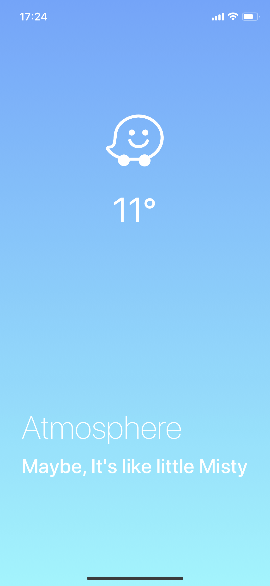
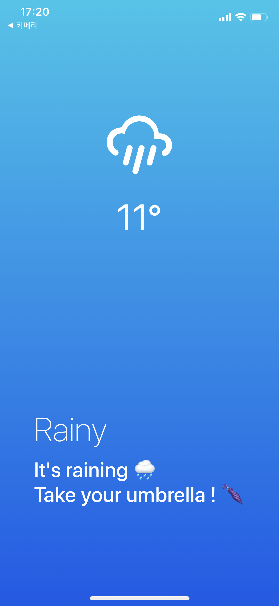
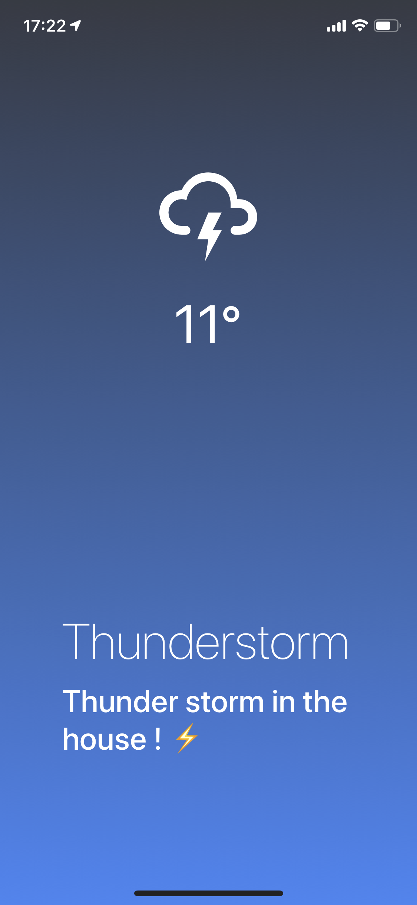
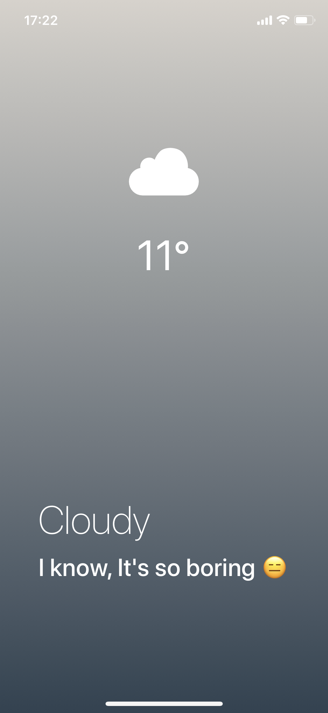
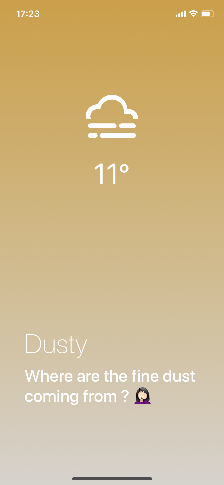

# 오늘의 날씨 (Today Weather)
[React Native] 리액트 네이티브로 날씨 앱 빌딩 (iOS, Android)

## React Native로 앱을 만든 이유?
React Native로 앱을 만들면 Java or Swift로 만드는 네이티브 iOS/Android 앱보다 1/4 빠르게 만들 수 있어서 선택 !  
React Native는 JS기반으로 작성되고 CSS도 사용 가능해서 다른 언어를 배울 필요 없이 개발이 가능하다.

## Expo vs RN CLI 중 Expo를 사용한 이유?
### Expo
* 리액트 네이티브로 하는 개발을 쉽게 할 수 있도록 도와주는 툴
* 리액트 네이티브를 위한 set-up이 미리 구성되어 있음 -> 개발이 편함
* 배포가 편하다 -> 처음 배포 후, Expo에 publish만 해주면 Expo가 알아서 업데이트 해줌
* But, 세부적인 세팅을 크게 제어할 수 없다.

### RN CLI
* 커스텀하게 세부적인 세팅이 가능하다.
* 자바스크립트 코드 관점에서 expo cli와 다른 점은, react native cli는 루트 컴포넌트에 AppRegistry.registerComponent를 요구한다는 것이다.  
이 메서드를 통해서 선택적으로 RN 루트컴포넌트를 여러개 가질 수 있다.   
expo cli는 디폴트로 App.js를 루트 컴포넌트로 사용한다.

## *오늘의 날씨* 앱 설명
현재 위치 & 시간을 기반으로 `openweathermap` API를 사용하여 사용자에게 현재 날씨 정보를 UI로 제공

## 사용 스택
* JavaScript
* ReactJS
* ReactNative
* Expo

## 실행 화면

